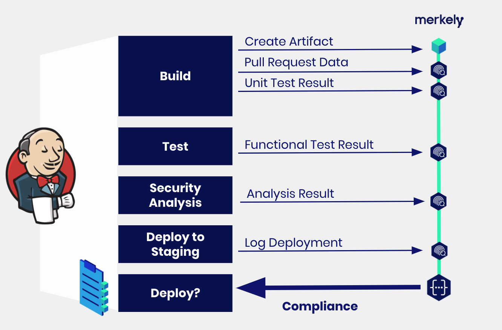

Logging Controls
================

An important aspect of DevOps compliance is meeting the expectations of
risk controls in the pipeline.  Examples include:

* Running unit tests/integration tests
* Performing security scanning
* Code coverage
* etc

In your :ref:`declare_pipeline-label` command you specify the names of the controls you expect to be performed in the pipeline.  As you execute these steps, you can use these commands to log the evidence that these controls have been performed.

* :ref:`control_pull_request-label` command to control and send evidence that a pull request is approved for this commit
* :ref:`log_test-label` command to send evidence that a test has been executed
* :ref:`log_evidence-label` command to send evidence that a generic control has been performed

Here is an example of how to use :ref:`log_evidence-label` from your pipeline:

.. describe_command:: log_evidence invocation_minimum docker

